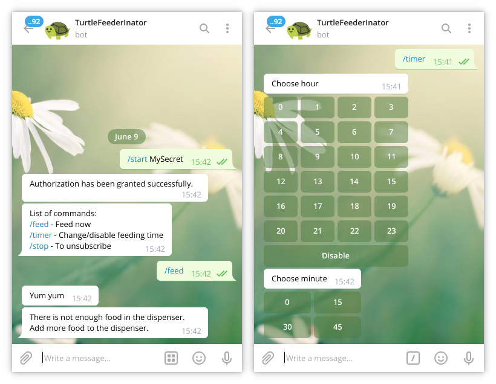

# TurtleFeederFirmware

Firmware dedicated for [TurtleFeederInator](https://github.com/kacpi2442/TurtleFeederInator).

## Features

* Telegram Bot with out of food notifications
* MQTT client
* Automatic feeding once a day
* Time synchronized to NTP server
* OTA Updates

## Getting started
You will need [PlatformIO IDE](https://platformio.org/platformio-ide) or at least [PlatformIO Core](https://platformio.org/install/cli)

Clone respository
```shell
git clone https://github.com/kacpi2442/TurtleFeederFirmware.git
cd TurtleFeederFirmware
```

Edit `config.h` by your favorite text editor
```shell
nano src/config.h
```

Build project
```shell
pio run -e d1_mini
```

Connect the device and upload the firmware
```shell
pio run --target upload -e d1_mini
```

## Editing config file
### Required changes
Insert your wifi credentials
```C
#define STASSID "MyWifi"    // SSID of your wifi network
#define STAPSK "MyPassword"    // Password of your wifi network
```

Set your timezone and DST settings
```C
#define timeZone 1    // Your timezone (CET by default)
#define useDST    // Comment this line if your country doesn't use daylight saving time
```

Change servo home position and out of food threshold if needed
```C
#define sensorTrigger 400    // (0-1023) lower is more sensitive
#define homePosition 8    // (0-180) Default servo position in degrees
```

### OTA Updates
To enable OTA Updates uncomment `#define USE_OTA` and change OTAPassword
```C
#define USE_OTA    // Uncomment to enable upgrading firmware via espota
#ifdef USE_OTA
    #define OTAhostname "TurtleFeederInator"    // mDNS hostname
    #define OTAPassword "Password123"    // Password for upgrading firmware via espota
#endif
```
To upload firmware via wifi you will also need to add a few lines in `platformio.ini` file
```
upload_port = <IP address of the device>
upload_protocol = espota
upload_flags = "--auth=<OTAPassword>"
```

### Telegram Bot
Create a bot by using [BotFather](https://telegram.me/botfather) and copy the access token

Uncomment `#define USE_TELEGRAM`, insert your token and change `telegramSecret`.
```C
#define USE_TELEGRAM    // Uncomment to enable Telegram Bot feature
#ifdef USE_TELEGRAM
    #define BOTtoken "123456789:xxxxxxxxxxxxxxxxxxxxxxxxxxxxxxxxxxx"    // your Bot Token (Get from Botfather)
    #define telegramSecret "MySecret"
    #define language 0    // [en - 0, pl - 1]
```

To be able to use the bot and receive notifications send this command to the bot
```
/start <your telegram secret>
```

#### Changing feeding time
Send `/timer` command to the bot or pass the time directly (ex. `/timer 21 37`)

### MQTT client
Uncomment `#define USE_MQTT` and insert credentials for your MQTT server
```C
#define USE_MQTT    // Uncomment to enable MQTT feature
#ifdef USE_MQTT
    #define mqttServer "192.168.1.xxx"    // Address/IP of your MQTT broker
    #define mqttPort 1883
    #define mqttUser "user"
    #define mqttPassword "Password123"
    #define mqttTopic "turtlefeeder/feed"
#endif
```

You can test this by using for example mosquitto client
```shell
mosquitto_pub -h 192.168.1.xxx -t turtlefeeder/feed -m "1" -u user -P "Password123"
```

## Licence
TurtleFeederFirmware is published under the [GPL license](LICENCE) because I believe in open development. The most straightforward way to comply with the license is to make a fork on Github, perform your modifications, and direct users to your modified fork. 
